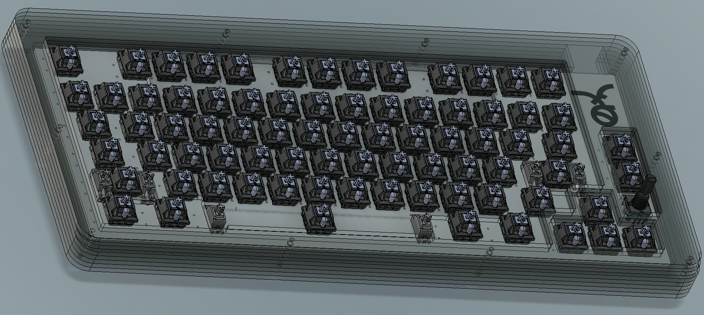

# Fernet (_fur-net_)

_"Fernet is an Italian type of amaro, a bitter, aromatic spirit. Fernet is made from a number of herbs and spices which vary according to the brand, but usually include myrrh, rhubarb, chamomile, cardamom, aloe, and especially saffron, with a base of grape distilled spirits."_

A 75% keyboard with a rotary encoder.

This one is really for me since it is only one layout and SMD Elite-C only, but figured I'd put it up here in case anyone is interested in an open source spaced F-row 75% board. More details to follow after initial build.
