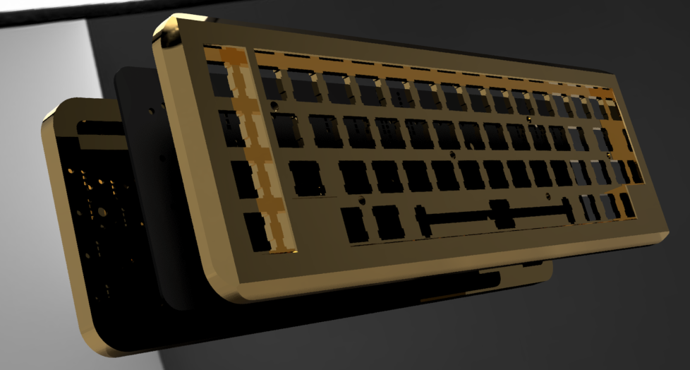

# Crossed Keys Nightmare

A 50% pseudo-TMO50 clone with an adjusted bottom row, designed on the cheap with a Pro Micro and 3D Printed case.

Keyboard/Case Designer: [Cody Bender](https://github.com/codybender) with help from Reggatronics/Reggalicious