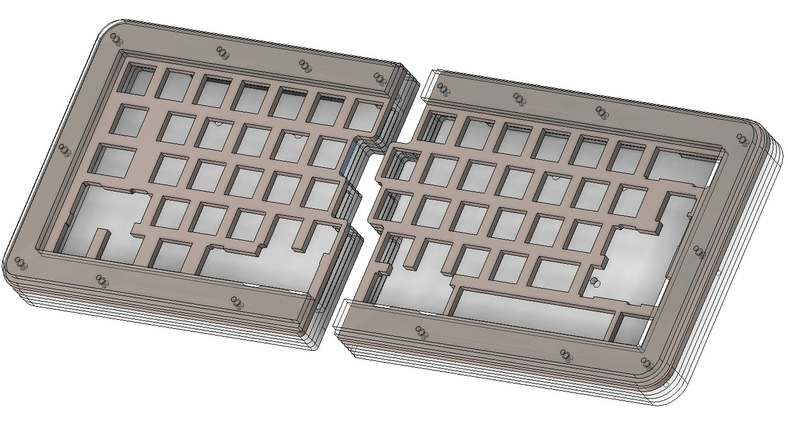

## Quefrency rev2 Case

Files originally taken from [Keebio's case repo](https://github.com/keebio/quefrency-case) and modified for all 3mm acrylic layers with my length M2 standoffs, along with increased bezels and feet bars.

Hardware: 
- 16 M2x15mm F/F brass standoffs (not hex)
- 32 M2x4mm screws (length flexible, minimum 4mm)
- For optional feet:
  - 4 M3x10mm screws (length flexible, minimum 10mm)
  - 4 M3 nuts
  - (this can be done numerous different ways, but this is my plan)
  
