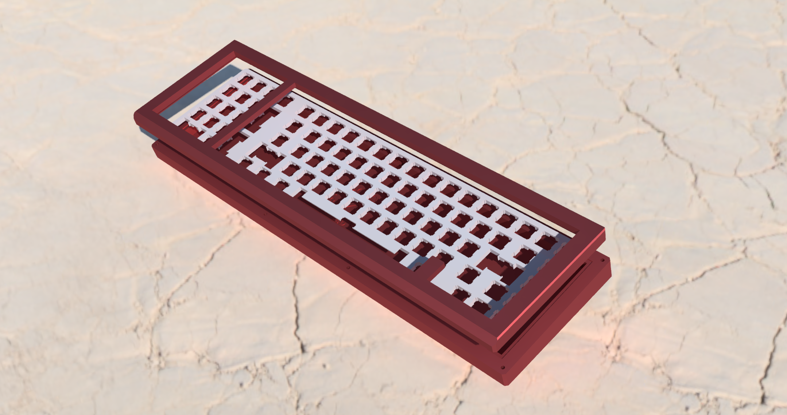

# Crossed Keys Southpole

A southpaw numpad with a classic 7u 65% design base.

Keyboard/Case Designer: [Cody Bender](https://github.com/codybender)  

Assembly guide: [On Google Drive](https://drive.google.com/open?id=1JN_OK8rfhoJso8HBKvpQtmv_5men5zyt0q0xczGZrWI)